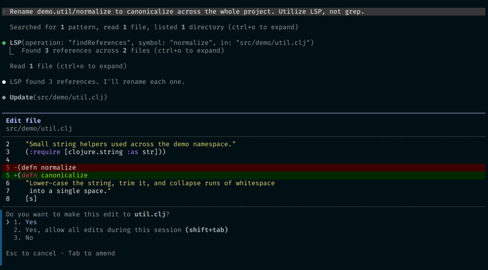

# clojure-lsp-plugin

A [Claude Code](https://claude.com/claude-code) marketplace that ships a
single plugin (`clojure-lsp`) wiring up
[clojure-lsp](https://clojure-lsp.io/) so Claude gets real-time code
intelligence (diagnostics, go-to-definition, find-references, hover) on
Clojure projects.



Above: Claude calling the LSP's `findReferences` rather than grepping, then
renaming all three call sites across two namespaces in one shot.

## Quick install

```bash
# 1. Make sure the clojure-lsp binary is on PATH
brew install clojure-lsp/brew/clojure-lsp-native                                                # macOS
# or, on Linux:
curl -s https://raw.githubusercontent.com/clojure-lsp/clojure-lsp/master/install | sudo bash

# 2. Add this marketplace and install the plugin
claude plugin marketplace add Kynde/clojure-lsp-plugin
claude plugin install clojure-lsp@clojure-lsp-marketplace
```

**3. Verify** — open Claude Code in any Clojure project (one with a
`deps.edn`, `project.clj`, or `bb.edn`) and run `/plugin`. The Installed
tab should list `clojure-lsp` as enabled and the Errors tab should be
empty. Then ask Claude something the LSP can answer, e.g. *"Find every
caller of `<some.ns>/<some-fn>` in this codebase."* — the first such
request kicks off indexing (a couple of minutes on a large project), then
it's instant.

See **[INSTALLATION.md](./INSTALLATION.md)** for the full walk-through
(host-wide vs. per-project setup, verification, updating, uninstall).

## Layout

```
clojure-lsp-plugin/
├── .claude-plugin/
│   └── marketplace.json          # marketplace manifest (lists the plugin)
├── plugins/
│   └── clojure-lsp/
│       ├── .claude-plugin/
│       │   └── plugin.json       # plugin manifest
│       ├── .lsp.json             # LSP server config
│       └── README.md
├── lspdemo.png                   # screenshot embedded in this README
├── INSTALLATION.md
└── README.md
```

## License

MIT — see `plugins/clojure-lsp/.claude-plugin/plugin.json`.
